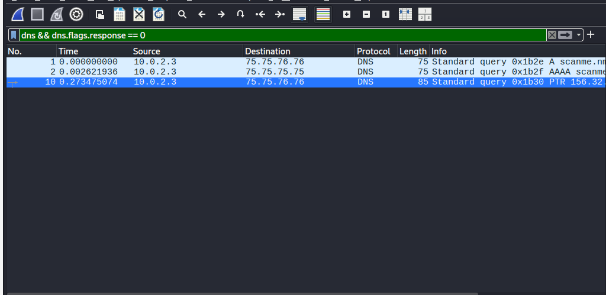
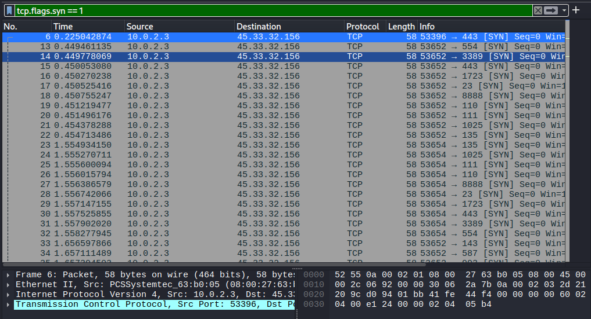
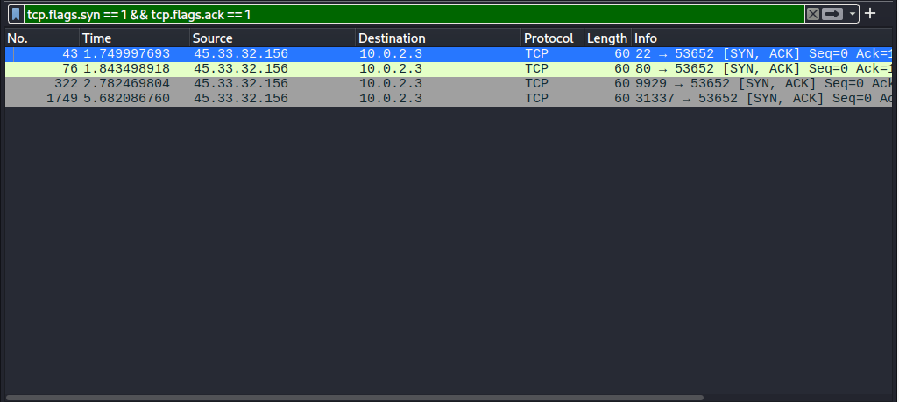

# Network Traffic Analysis (Wireshark)

## Overview
This folder documents my hands-on analysis of network traffic during reconnaissance. By capturing raw data with **Wireshark**, I examined how specific discovery activities—like DNS resolution and TCP port scanning—look at the packet level.

## Environment 
- **OS:** Kali Linux
- **Analysis Tool:** Wireshark
- **Interface:** eth0
- **Traffic Source:** Local machine

## Lab Analysis & Observations

### 1. DNS Resolution
Before a network scan can reach its destination, the system must resolve the domain name. I isolated the outbound DNS queries to observe the system identifying the target's IP infrastructure.
- **Display Filter:** `dns && dns.flags.response == 0`

### 2. Identifying TCP SYN Stealth Scans
I analyzed TCP traffic patterns to identify characteristics of a SYN-based reconnaissance scan. By filtering for packets with the SYN flag set, I observed a sequence of TCP connection initiation attempts used to probe for open services across multiple ports.
- **Display Filter:** `tcp.flags.syn == 1`

**Interpretation:** This filter captures all TCP packets where a connection is being initiated. In a reconnaissance context, a high volume of SYN packets across multiple ports within a short timeframe is indicative of automated port scanning activity. While this filter also includes legitimate connection attempts, scan behavior can be inferred through timing, frequency, and distribution patterns.

- Scan detection in real environments typically relies on correlation of multiple packets rather than a single filter condition.
  
### 3. Service Verification (SYN-ACK Responses)
To confirm which ports were identified as active and "Open," I filtered for the target's response. A `[SYN, ACK]` packet indicates that the target port is open and actively listening and completing the TCP handshake.
- **Display Filter:** `tcp.flags.syn == 1 && tcp.flags.ack == 1`

  
---

## Display Filter Reference

| **Filter** | **Security Significance** |
| :--- | :--- |
| `dns` | General inspection of name resolution traffic. |
| `dns && dns.flags.response == 0` | Isolates requests to identify target domain lookup attempts. |
| `tcp.flags.syn == 1` | Primary indicator of automated port scanning behavior. |
| `tcp.flags.syn == 1 && tcp.flags.ack == 1` | Identifies live services and successful TCP handshakes. |

---

## Key Takeaways
- **Protocol Insights:** Gained a deeper understanding of the TCP 3-way handshake and how it is manipulated for reconnaissance.
- **Traffic Fingerprinting:** Learned to distinguish automated scanning "bursts" from normal network noise.
- **Incident Response:** Mastering these filters is a fundamental skill for detecting early-stage network probing and unauthorized activity.
